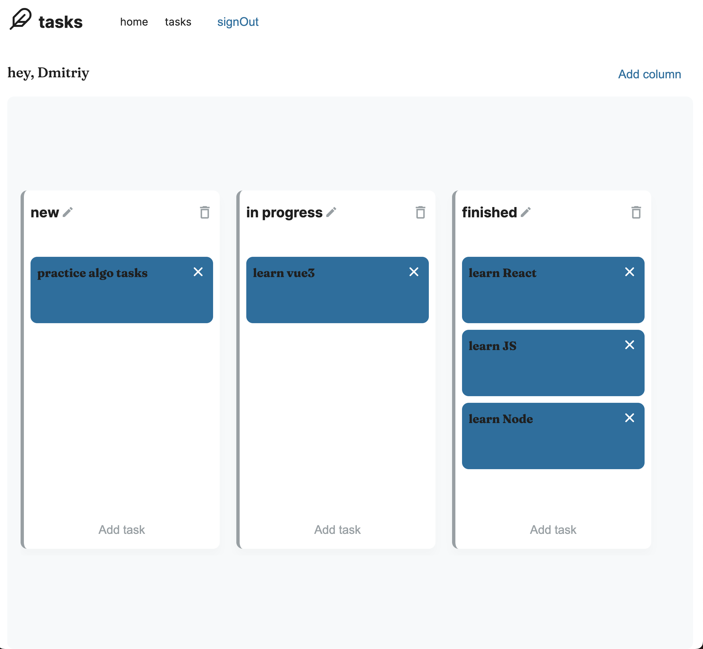
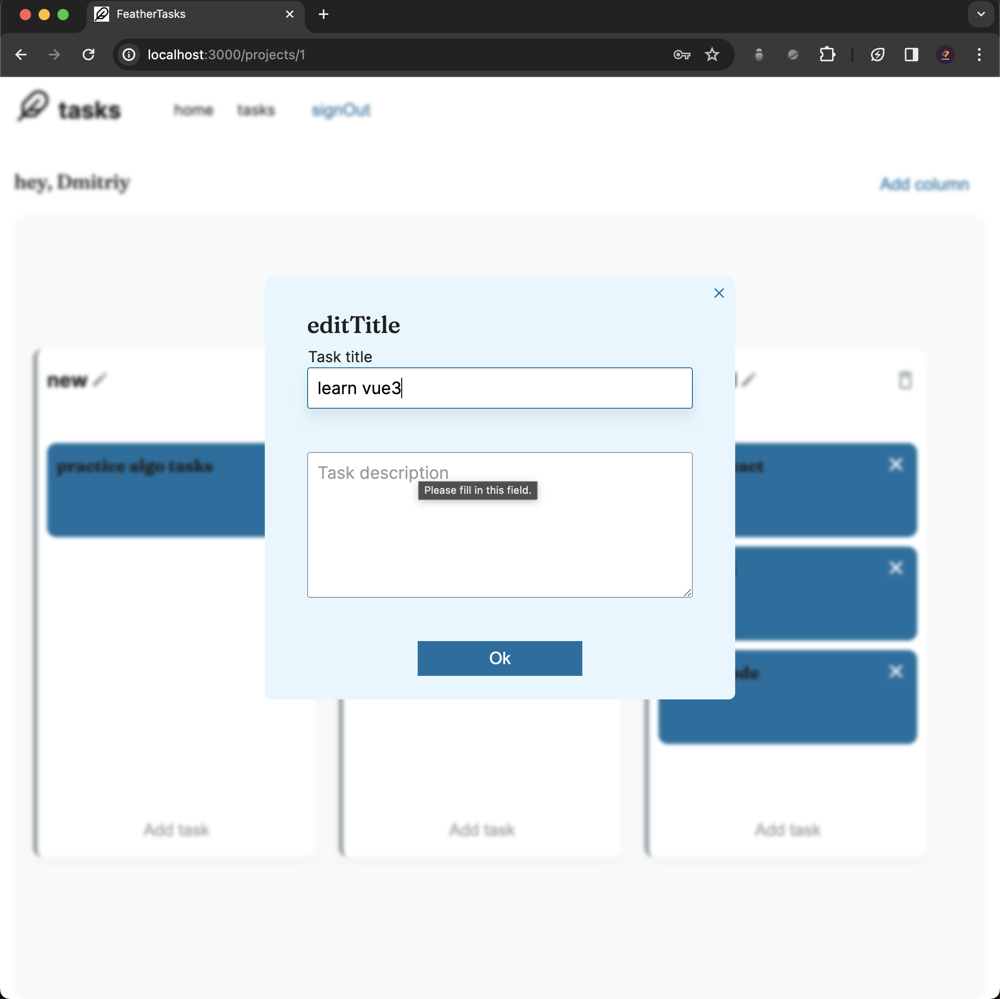

# Feather_tasks

it's a web-app for personal task and purposes managements.

[deploy link](https://feather-tasks.onrender.com)

[backend repository](https://github.com/dmtrack/feather_tasks_server)

> **Attention!** The backend and data-base are deployed on a free service render.com, so when you run the application for the first time, you need to wait a little bit. Thank you ✊🏻

## Preview

## Stack

### Frontend

-   react@18
-   react-router-dom@6
-   typescript
-   reduxjs/toolkit
-   reduxjs/rtk-query
-   eslint
-   prettier
-   husky
-   CI/CD

### UI

-   styled-components

### Backend

-   nodeJS
-   typescript
-   express
-   jsonwebtoken

### DB

-   postgreSQL (Sequelize)
